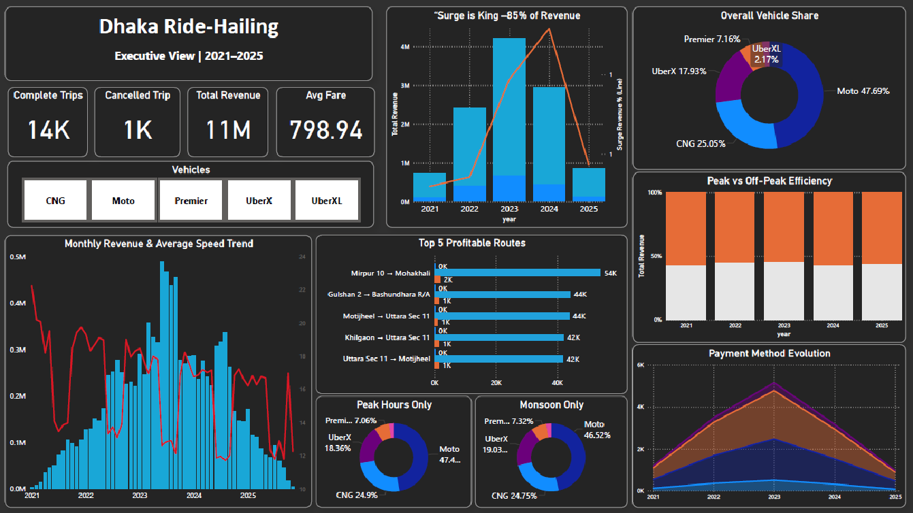

# 🚖 Dhaka Ride-Hailing Analysis (2021–2025)

An end-to-end data analytics project simulating and analyzing the ride-sharing ecosystem of Dhaka, Bangladesh. This project utilizes **Python** for synthetic data generation, **SQL** for strategic insights, and **Power BI** for executive visualization.

*(Executive Dashboard View)*

## 📌 Project Overview
Dhaka is known for its extreme traffic and unique commuting challenges. This project analyzes a realistic dataset of **50,000 trips** and **15,000 cancellations** over 5 years to understand:
- Revenue drivers (Surge pricing impact).
- Operational bottlenecks (Monsoon season & Peak hours).
- Market shifts (Vehicle preferences & Payment methods).

## 📄 Project Reports (PDF)
I have prepared two detailed reports catering to different stakeholders:

1.  **[📘 Strategic Business Case (For Managers)](Reports/Market_Analysis/Strategic_Business_Case.pdf)**
    * *Focus:* Market gaps for new entrants, profitability analysis, and operational recommendations.
2.  **[📙 Technical Analysis Report (For Data Teams)](Reports/Technical_Analysis_Report/Technical_Analysis_Report.pdf)**
    * *Focus:* Data pipeline methodology, feature engineering logic, and SQL performance metrics.

## 🛠️ Tech Stack
- **Python (Pandas, NumPy):** Used for generating a hyper-realistic dataset with logic for inflation, traffic decay, and seasonal weather patterns.
- **SQL:** Used for exploratory data analysis (EDA) and deriving key business metrics (KPIs).
- **Power BI:** Used for building an interactive dashboard with DAX measures and advanced visualization.

## 🔍 Key Insights
1.  **Surge is King:** Surge pricing contributes **83.7%** of total revenue, confirming the high-demand nature of Dhaka's market.
2.  **The "Monsoon Effect":** During the rainy season (June–Sept), average traffic speed drops by **28%**, causing a spike in surge multipliers (1.59x).
3.  **Moto Dominance:** Motorbikes maintain a **~48% market share**, proving that speed filters through traffic are valued more than comfort.
4.  **Digital Shift:** Payment preference shifted from Cash (35% in 2021) to Mobile Money (43% in 2025).

## 📂 Project Structure
- `Data/`: Contains the synthetic CSV datasets (`rides` and `cancellations`).
- `Scripts/`: Jupyter Notebook for data generation & SQL queries for analysis.
- `Dashboard/`: Power BI `.pbix` file and high-res screenshots.

## 🚀 How to Use
1.  **Python:** Run the `data_generation.ipynb` to regenerate or modify the dataset logic.
2.  **SQL:** Load the CSVs into any SQL database and run `analysis_queries.sql` to verify insights.
3.  **Power BI:** Open `Dhaka_Ride_Hailing.pbix` to interact with the dashboard.

---
## Author
**Md. Arif Hossain Rumi**  
Data Analyst | Python • SQL • Power BI  
[LinkedIn](https://linkedin.com/arifhossainrumi)
